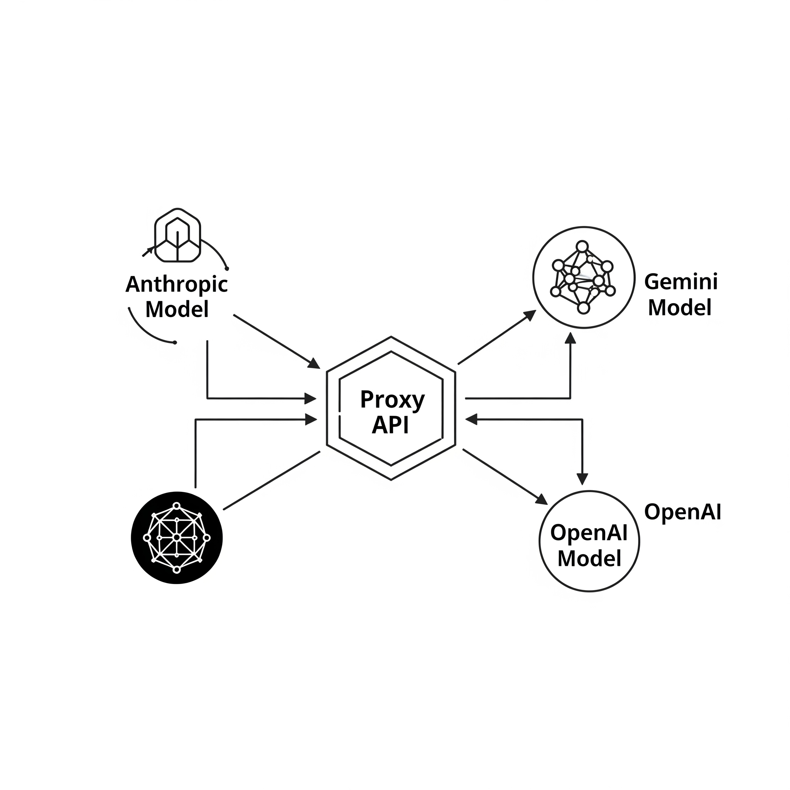

# LLM Bridge for Claude Code: Your Gateway to Free & Open-Source LLMs (via Ollama) ✨

**This project extends the original [claude-code-proxy](https://github.com/1rgs/claude-code-proxy) to seamlessly integrate with 100% free and open-source LLMs via Ollama.**

**Run Anthropic clients (like Claude Code) with your favorite local LLMs, powered by Ollama!** This proxy provides a seamless bridge to 100% free and open-source models, right from your machine. 🔗


## Installation & Usage 🚀

Getting started is a breeze with our interactive `install.sh` script! It handles everything from setting up your environment to configuring your preferred LLM provider.

**Prerequisite**: This project assumes you have the [Ollama server](https://ollama.com/download) already installed and running on your machine. If not, please download and install it first:
-   **macOS**: [Download Ollama for macOS](https://ollama.com/download/mac)
-   **Windows**: [Download Ollama for Windows](https://ollama.com/download/windows)
-   **Linux**: Follow the instructions on the [Ollama website](https://ollama.com/download/linux)


1.  **Clone the repository**:
    ```bash
    git clone https://github.com/guychenya/LLMBridgeClaudeCode.git
    cd LLMBridgeClaudeCode
    ```

2.  **Run the installer script**:
    ```bash
    bash install.sh
    ```

    The script will guide you through the setup process, including selecting a model based on your primary task (coding, chat, or multimodal).

    <details>
    <summary>Click to see installer output example</summary>

    ```text
    [INFO] Starting LLM Bridge for Claude Code Installer...
    [INFO] Checking for required tools: git, uv, npm, ollama...
    [INFO] Configuring environment variables in .env...
    ?[CHOICE] Choose your preferred LLM provider [ollama]: 
      1) ollama
      2) openai
      3) google
    #? 1
    [INFO] Set PREFERRED_PROVIDER to ollama in .env.
    [INFO] Ollama selected. No API keys needed for Ollama models.
    ?[CHOICE] Choose your primary task [coding]: 
      1) coding
      2) chat
      3) multimodal
    #? 1
    ?[CHOICE] Choose a coding model to download [codellama:13b]:
      1) codellama:13b
      2) deepseek-coder:33b-instruct
      3) starcoder2:15b
    #? 1
    [INFO] Model 'codellama:13b' not found locally. Attempting to pull...
    [SUCCESS] Successfully pulled Ollama model 'codellama:13b'.
    [INFO] Set both BIG_MODEL and SMALL_MODEL to 'codellama:13b' in .env.
    [INFO] Installing Python dependencies using uv...
    [SUCCESS] Python dependencies installed.
    [INFO] Installing Claude Code CLI globally using npm...
    [SUCCESS] Claude Code CLI installed.
    [INFO] Starting the proxy server in the background...
    [SUCCESS] Proxy server started in the background with PID: 12345. Output logged to proxy_server.log
    [INFO] To stop the server, run: kill 12345
    [SUCCESS] Installation complete!
    [INFO] Creating 'claudebr' command for easy access...
    [SUCCESS] 'claudebr' command installed successfully.

    --- Next Steps ---
    1. Run Claude Code CLI using the new 'claudebr' command:
       claudebr

    Enjoy using Claude Code with your chosen LLM backend!
    ```
    </details>

### What the Installer Does ✨

Our `install.sh` script isn't just a simple setup; it's packed with features to make your life easier:

-   **Guided Model Selection**: Helps you choose and download the best model for your task (coding, chat, or multimodal).
-   **Interactive Provider Choice**: Guides you through selecting Ollama, OpenAI, or Gemini as your primary LLM provider.
-   **Disk Space Guardian**: Before downloading large Ollama models, it checks for sufficient disk space and warns you if space is low.
-   **Automatic Server Launch**: Automatically starts the proxy server in the background after a successful installation.
-   **`claudebr` Command**: Creates a convenient `claudebr` command to run the Claude Code CLI with the local proxy.
-   **Robust Error Handling**: Provides informative messages for common issues.

## `claudebr` Command

The installer creates a `claudebr` command that simplifies running the Claude Code CLI with the local proxy. Instead of typing `ANTHROPIC_BASE_URL=http://localhost:8083 claude`, you can simply run:

```bash
claudebr
```

### Global Installation (Optional)

By default, `claudebr` is created in the project directory. If you wish to use `claudebr` from any directory in your terminal, you might need to move it to a directory included in your system's PATH, such as `/usr/local/bin`.

If the installer warns that `/usr/local/bin` is not writable, you can manually move the `claudebr` script using `sudo`:

```bash
sudo mv claudebr /usr/local/bin/
```

**Note**: For most users, this global installation is not necessary as you will typically run `claudebr` from within the cloned project's directory.

## Model Mapping 🧭

This proxy intelligently maps Claude's `haiku` and `sonnet` models to your chosen `SMALL_MODEL` and `BIG_MODEL` respectively. When `PREFERRED_PROVIDER=ollama`, it automatically prefixes your selected Ollama models with `ollama/`.

### Supported Ollama Models

Here are some popular Ollama models you can use (make sure to `ollama pull` them first!):
-   `llama2`
-   `llama3`
-   `gemma`
-   `mistral`
-   `phi`
-   `tinyllama`
-   `codellama`
-   `deepseek-coder`
-   `starcoder`
-   `wizardcoder`
-   `llava` (multimodal)
-   `minicpm-v` (multimodal)
-   `llama3.2`
-   `qwen2`
-   `mistral-large`
-   `dolphin-2.6`

*You can find more models and their details on the [Ollama website](https://ollama.com/library).* 

## How It Works ⚙️

This proxy acts as a clever translator:

1.  **Receives** Anthropic API requests from your Claude client. ⬇️
2.  **Translates** them into a format LiteLLM understands (which then talks to Ollama). ↔️
3.  **Sends** the request to your local Ollama server. ⬆️
4.  **Converts** Ollama's response back to Anthropic format. ↔️
5.  **Returns** the magic to your Claude client! 🎉

It handles both streaming and non-streaming responses, keeping your Claude experience smooth. 💧



## Why Try LLM Bridge for Claude Code? 💡

This project offers several compelling advantages:

-   **100% Free & Open-Source LLMs**: Leverage powerful language models without API costs or reliance on external services. Your data stays local!
-   **Enhanced Privacy**: Since models run on your machine, your interactions remain private and secure.
-   **Cost-Effective Development**: Experiment and build with LLMs without incurring API usage fees.
-   **Seamless Claude Code Integration**: Continue using the familiar Claude Code CLI, now powered by your local models.
-   **Easy Setup**: The `install.sh` script makes getting started incredibly simple, even for those new to local LLMs.
-   **Flexibility**: While optimized for Ollama, it still supports OpenAI and Google Gemini for broader compatibility.

## Contributing 💖

Got ideas? Found a bug? Contributions are super welcome! Feel free to submit a Pull Request. 💡
